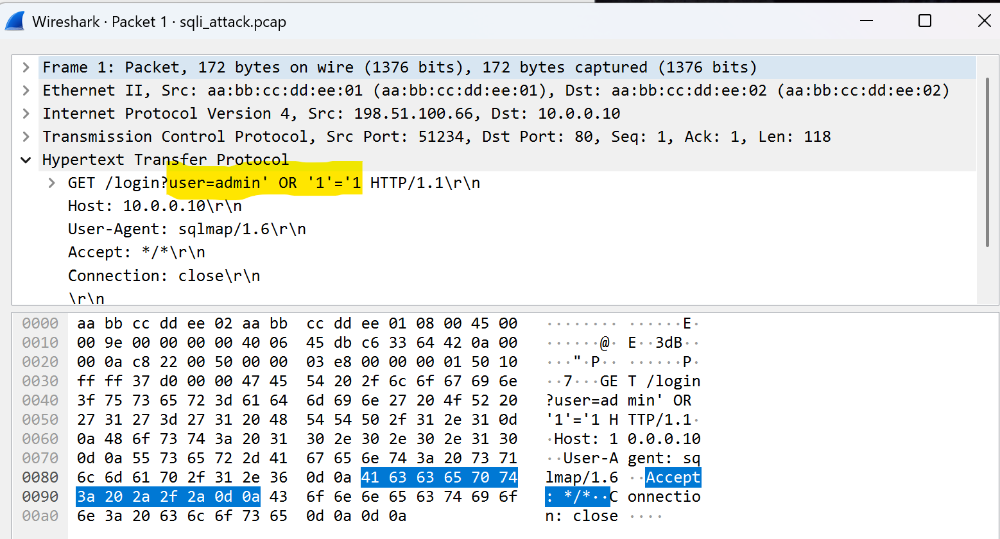
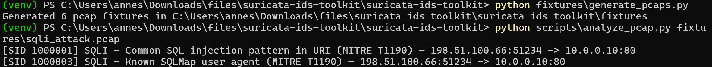
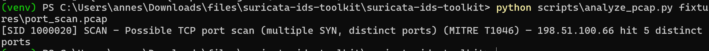
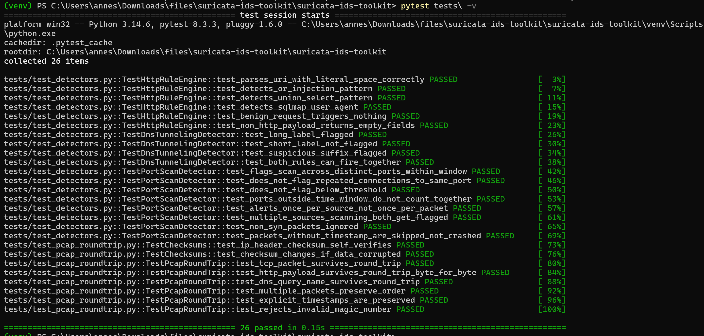

# Suricata / IDS Toolkit — PCAP Analysis + Detection Rules

Real Suricata-format IDS rules (SQL injection over HTTP, DNS tunneling,
TCP port scanning) plus a from-scratch, pure-Python PCAP writer/reader/
analyzer — no scapy, no dpkt, no Suricata binary required to test the
detection logic. Every packet in the test fixtures is hand-constructed
byte-by-byte (Ethernet/IPv4/TCP/UDP headers, including correctly
computed checksums), which is honestly a better demonstration of protocol
understanding than wrapping a library call.

## Why build packet construction from scratch

There's real value in NOT reaching for scapy here: writing the IPv4/TCP/
UDP headers by hand with `struct.pack`, computing the RFC 1071 Internet
checksum correctly, and implementing the pseudo-header for TCP/UDP
checksums is exactly the kind of low-level protocol knowledge that
distinguishes "I called a scanning tool" from "I understand what the tool
is actually doing." Every checksum is verified correct — see "Testing
status" below, including an independent self-verification check (a
correct IPv4 header's word-sum including its own checksum field must
equal exactly `0xFFFF`) — and now, verified further, real Wireshark
parses the generated packets correctly.

## Repository layout

```
suricata-rules/                 real Suricata rule syntax (.rules files)
  sql_injection_http.rules
  dns_tunneling.rules
  port_scan_detection.rules
pcap_toolkit/
  packet_builder.py               hand-rolled Ethernet/IPv4/TCP/UDP/DNS/HTTP construction
  pcap_writer.py                   writes real libpcap-format files
  pcap_reader.py                   parses them back into normalized dicts
detection/
  http_rule_engine.py              Python mirror of the SQLi Suricata rules
  dns_tunneling_detector.py         Python mirror of the DNS Suricata rules
  port_scan_detector.py             Python mirror of the port-scan rule (sliding time window)
fixtures/
  generate_pcaps.py                 builds 6 real pcap files (3 attack, 3 benign)
scripts/
  analyze_pcap.py                    CLI: run all detectors against a pcap
tests/
  test_pcap_roundtrip.py
  test_detectors.py
```

## Try running below

```bash
python fixtures/generate_pcaps.py
python scripts/analyze_pcap.py fixtures/sqli_attack.pcap
python scripts/analyze_pcap.py fixtures/dns_tunneling.pcap
python scripts/analyze_pcap.py fixtures/port_scan.pcap
python scripts/analyze_pcap.py fixtures/benign_http.pcap   # confirms no false positives
```

Zero dependencies beyond the Python standard library.

## Verifying the generated PCAPs in Wireshark

```bash
python fixtures/generate_pcaps.py
```
Then open any of the generated `.pcap` files directly in Wireshark
(File → Open). Every packet is hand-built from scratch by this project's
own code — no scapy, no dpkt — and Wireshark parses them as fully valid
captures, correctly decoding the Ethernet/IP/TCP/HTTP layers.

## Running the tests

```bash
pytest tests/ -v
```

## Screenshots

### Real Wireshark opening a hand-crafted packet

`fixtures/sqli_attack.pcap` opened in real Wireshark — the packet was
built entirely from scratch by `pcap_toolkit/packet_builder.py` (raw
Ethernet/IPv4/TCP headers via `struct.pack`, no scapy), and Wireshark
correctly parses it as a valid HTTP request, showing the SQL injection
payload (`admin' OR '1'='1`) both in the decoded HTTP layer and in the
raw hex dump below. This confirms the packets aren't just internally
self-consistent — they're valid enough for a completely independent,
industry-standard tool to parse correctly.

### SQL injection detection

`python scripts/analyze_pcap.py fixtures/sqli_attack.pcap` — correctly
flags both the `' OR '` injection pattern and the sqlmap user agent,
each tagged with MITRE ATT&CK T1190.

### Port scan detection

`python scripts/analyze_pcap.py fixtures/port_scan.pcap` — correctly
detects a single source hitting 5 distinct ports within the time window,
tagged with MITRE ATT&CK T1046.

### Test suite

`pytest tests/ -v` — all 26 tests passing, covering checksum correctness,
full PCAP round-trip fidelity, and all 3 detectors against both attack
and benign traffic.

26 tests: 8 on PCAP round-tripping (including independent checksum
verification and a corrupted-data sanity check), 18 on the three
detectors — covering the port scan detector's sliding time window
specifically (5 ports in 10 seconds triggers; the same 5 ports spread
across 100 seconds does NOT, since no 10-second slice contains all 5).

## A real bug caught mid-build

While testing the SQLi detection against a real crafted packet, I found
that `parse_http_request`'s naive `request_line.split(" ")` truncated the
URI at the first space — and the fixture's own attack payload
(`admin' OR '1'='1`) has literal unencoded spaces in it, so the URI was
silently cut down to `/login?user=admin'`, losing the injection pattern
entirely and causing the "' OR '" rule to miss a case it should have
caught. Fixed by anchoring on the method prefix and `HTTP/x.x` suffix via
regex instead of naive splitting, so everything in between — spaces and
all — is captured as the URI. `tests/test_detectors.py`'s
`test_parses_uri_with_literal_space_correctly` is a permanent regression
test for this exact bug.

## Testing status

- ✅ **Checksums are provably correct, not just "probably fine"**: verified
  via RFC 1071's self-check property (a correctly checksummed IPv4
  header's 16-bit words sum to exactly `0xFFFF`), and via a corruption
  test confirming the checksum function actually changes when data is
  tampered with (not a no-op).
- ✅ **Full round-trip fidelity**: build → write to real pcap format →
  read back → parse — confirmed byte-for-byte payload preservation (HTTP
  requests, DNS query names) and correct field extraction (IPs, ports,
  TCP flags) across all packet types.
- ✅ **All 3 detectors tested against both attack and benign traffic**,
  including edge cases: the port scan detector's time-window boundary
  (same 5 ports within vs. outside the window), "alert once per source,
  not once per packet" semantics, and non-SYN packets correctly ignored.
- ✅ **Verified against real Wireshark**: opened the generated
  `sqli_attack.pcap` in Wireshark and confirmed it correctly parses the
  Ethernet/IP/TCP/HTTP layers, with the injected SQL payload visible in
  both the decoded HTTP request and the raw hex dump — independent
  confirmation that the hand-built packets are valid, not just
  internally self-consistent.
- ⚠️ **The `.rules` files themselves have never been loaded into a real
  Suricata instance.** The Python detectors in `detection/` are
  hand-verified reimplementations of the same logic, not a Suricata rule
  parser — if you install real Suricata and load these `.rules` files,
  the syntax was written carefully against Suricata's documented rule
  format, but treat it as needing a real first run before trusting it
  fully.

## Limitations

- **PCAP parser handles IPv4 + TCP/UDP only** — no IPv6, no VLAN tags, no
  IP fragmentation reassembly. Real analysis tools (Wireshark, Suricata
  itself) handle far more of the protocol space.
- **DNS tunneling detection is pattern-based, not statistical** — a real
  production detector would likely also look at query volume/frequency
  per domain and entropy of the full query name, not just label length
  and a substring match.
- **Port scan detection doesn't distinguish scan types** (SYN scan vs.
  connect scan vs. FIN/XMAS scan) — only SYN-flag packets are considered.

## License

MIT — see [LICENSE](./LICENSE).
